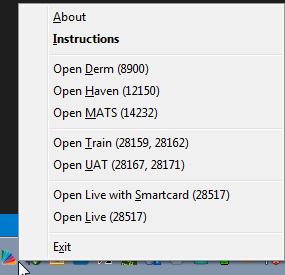

# Everyday Helper (for Bristol Community Health)

This is an AutoHotKey helper program used to speed up processes in the Bristol Community Health  Application Support Team, called "Everyday Helper". We use EMIS - many domains, and reset passwords often - so this AutoHotKey program helps with processes such as that.

To install for your own use, simply download and run the main executable:
* [Everyday Helper.exe](https://github.com/MrSimonC/BCH-Helper/blob/master/Everyday%20Helper.exe?raw=true)

The program will run in the tray and if you double click the icon, or right click on the icon choose "Instructions" menu,  you will see the list of commands.

To restart the program use `Ctrl+Esc` key.

To quit the program use `Ctrl+Shift+Esc` key.
